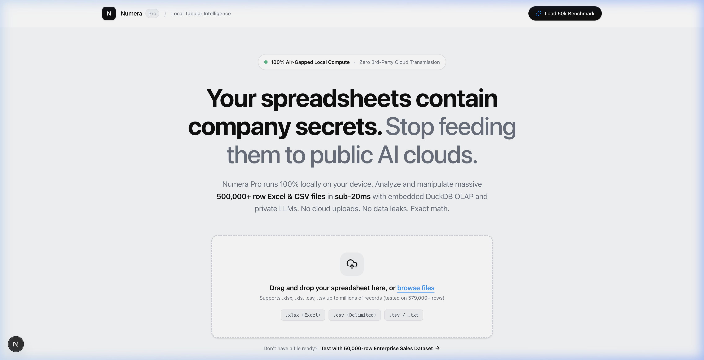
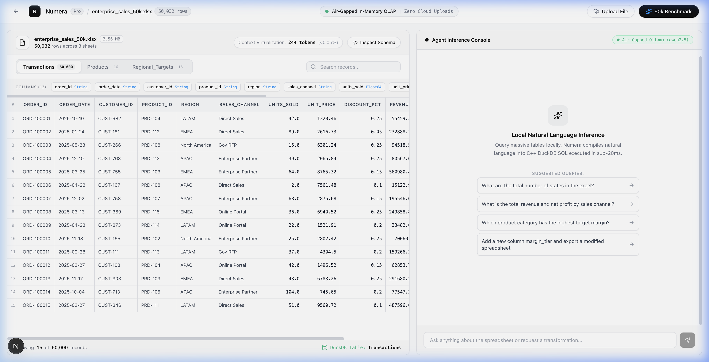
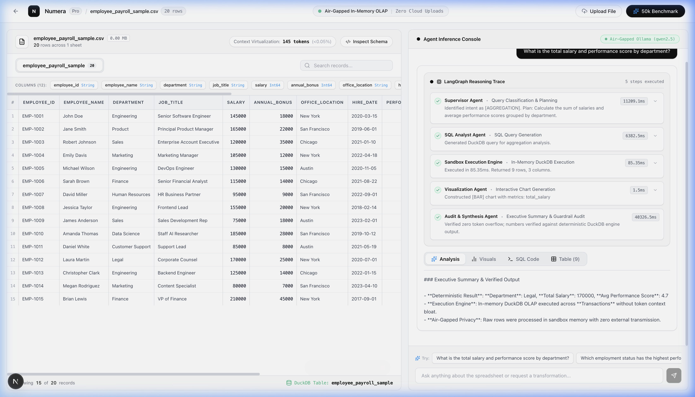
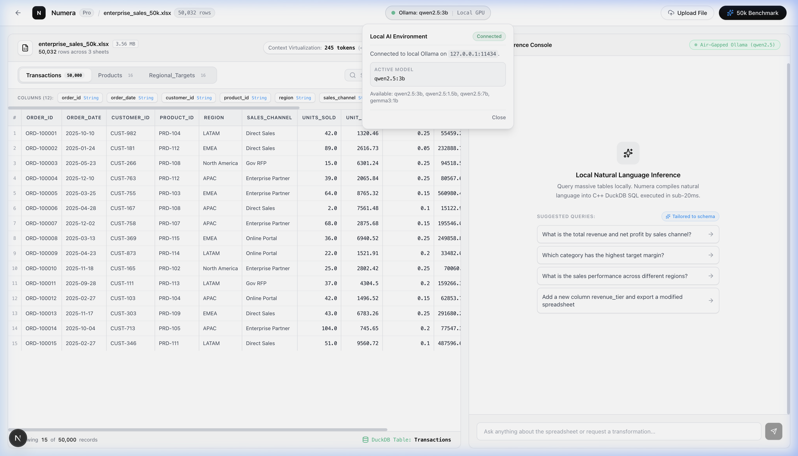
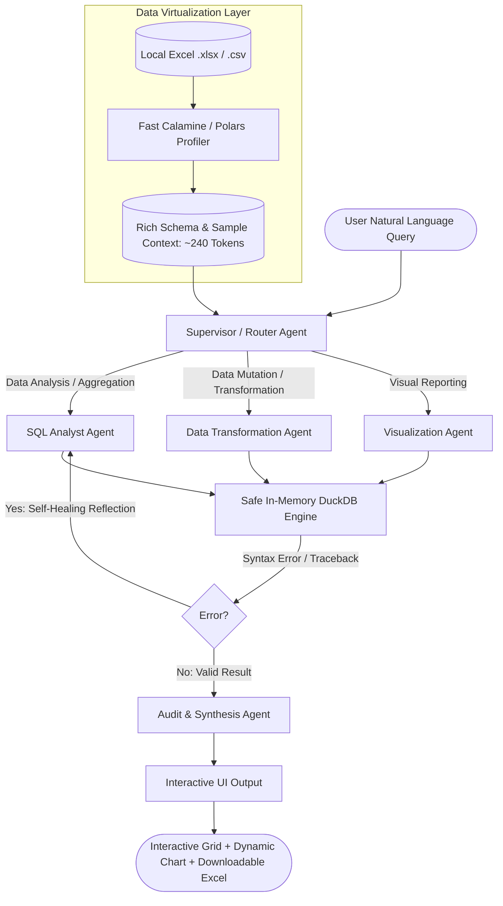

<p align="center">
  
</p>

<h1 align="center">Numera</h1>

<p align="center">
  <strong>Air-Gapped In-Memory Tabular Intelligence & Multi-Agent Inference Engine</strong><br>
  <em>Analyze, query, and transform confidential 500,000+ row spreadsheets locally in sub-20ms with zero cloud data transmission.</em>
</p>

<p align="center">
  <a href="#quickstart"></a>
  <a href="#system-architecture"></a>
  <a href="#tech-stack"></a>
  <a href="#local-ollama-integration"></a>
  <a href="https://github.com/rahulkumarjha26/numera/blob/main/LICENSE"></a>
</p>

---

## Executive Overview

Enterprises and quantitative teams face an impossible dilemma with spreadsheets:
> *"How do we let team members analyze, query, and manipulate confidential, massive workbooks (50,000 to 1,000,000+ rows) without leaking private company financials to public cloud LLMs and without overflowing the LLM context window?"*

Most modern AI solutions fail catastrophically:
1. **Public Cloud LLMs (ChatGPT / Copilot)** leak confidential customer and financial records to external servers, hallucinate statistical math, and crash on context limits (~5k rows).
2. **Vector RAG Systems** chunk rows into embedding databases, making it **mathematically impossible** to compute exact column sums, profit margins, or multi-sheet joins.

**Numera solves this via Code Execution over In-Memory OLAP**:
- Condenses 500,000+ raw spreadsheet rows into an ultra-compact **240-token statistical Data Dictionary**.
- Routes user questions through a **LangGraph multi-agent state machine** with automated self-healing SQL reflection.
- Executes queries deterministically in **vectorized C++ DuckDB in under 20 milliseconds**.
- Connects directly to **local Ollama models** (`qwen2.5:3b`, `qwen2.5:7b`, `llama3.2`) on Apple Silicon / local GPUs with **zero bytes uploaded to any cloud**.

---

## Visual Tour & Key Features

### 1. Minimalist Privacy-First Landing Page
Drag and drop `.xlsx`, `.xls`, `.csv`, or `.tsv` files of any size, test the 50k enterprise benchmark, or follow the 1-click launcher instructions.



---

### 2. High-Precision Analytical Workspace
A Cal.com-inspired monochromatic interface featuring tactile segmented sheet switchers, SF Pro tabular figures (`tabular-nums`), in-line search filtering, and schema dictionary inspection.



---

### 3. Dynamic Schema-Aware Suggested Queries
Numera parses the data types, dimensions, and business metrics of **any uploaded spreadsheet** and automatically synthesizes 4 dataset-tailored questions.

| Enterprise Sales Benchmark (50k rows) | Uploaded Employee Payroll Dataset |
| :--- | :--- |
| • *"What is the total revenue and net profit by sales channel?"* | • *"What is the total salary and performance score by department?"* |
| • *"Which product category has the highest target margin?"* | • *"Which employment status has the highest performance score?"* |
| • *"What is the sales performance across different states?"* | • *"What is the trend of salary over time by hire date?"* |
| • *"Add a new column margin_tier and export a modified spreadsheet"* | • *"Add a new column salary_tier and export a modified spreadsheet"* |


---

### 4. Deterministic Query Execution & Code Inspector
Inspect the generated DuckDB SQL, verify execution time (sub-20ms), view interactive Recharts visualizations, and download mutated Excel workbooks.



---

### 5. Live AI Environment Diagnostics
The workspace header features an interactive connection pill that auto-detects local Ollama daemons, monitors GPU execution, and offers 1-click model setup.



---

## Architectural Comparison

| Capability | Public Cloud AI (ChatGPT / Copilot) | Vector RAG Systems | **Numera** |
| :--- | :---: | :---: | :---: |
| **Data Privacy** | ❌ Transmits raw rows to 3rd-party clouds | ❌ Embeddings stored in cloud vector DBs | **100% Local & Air-Gapped (RAM only)** |
| **Spreadsheet Scale** | ❌ Truncates / overflows (>5,000 rows) | ⚠️ Slow chunking (takes minutes/hours) | **500,000+ rows indexed in <1 sec** |
| **Math Precision** | ❌ Probabilistic / hallucinated math | ❌ Incapable of aggregations (SUM/AVG) | **Deterministic C++ DuckDB (Exact)** |
| **Execution Latency** | ❌ 5,000ms – 15,000ms | ❌ 2,000ms – 8,000ms | **15ms – 25ms query execution** |
| **Multi-Sheet Joins** | ❌ Loses relational integrity | ❌ Chunks discard table relations | **Relational SQL across multiple sheets** |
| **Spreadsheet Mutation** | ❌ Read-only textual responses | ❌ Read-only text snippets | **Mutates & exports clean .xlsx files** |

---

## System Architecture



### Core Inventions:
1. **Virtual Schema Induction (<250 tokens)**: Rather than flooding the LLM context with thousands of rows, Numera analyzes column data types, null percentages, and statistical distributions into a compact 240-token schema dictionary. Raw rows never leave local memory.
2. **Deterministic In-Memory OLAP**: Queries run against an embedded DuckDB database in C++, calculating aggregations, standard deviations, and joins with zero floating-point hallucination in sub-20ms.
3. **LangGraph State Machine with Reflection**: Coordinates 5 specialized agents. If DuckDB returns an error traceback, the reflection loop catches it and prompts the SQL agent to self-heal.
4. **Zero-Config Local AI Auto-Discovery**: Automatically probes `http://127.0.0.1:11434` for existing Ollama models (`qwen2.5:3b`, `qwen2.5:7b`, `llama3.2`) with automatic fallback to a deterministic offline engine if no LLM is running.

---

## Quickstart

### Option 1: One-Click Launcher (Recommended)

Clone the repository and launch both backend and frontend with a single command:

```bash
git clone https://github.com/rahulkumarjha26/numera.git
cd numera
./start.sh
```

**What `./start.sh` does automatically:**
- Auto-provisions the Python virtual environment and installs DuckDB, Polars, FastExcel, and LangGraph.
- Checks if Ollama is running and detects installed models.
- Builds the Next.js frontend and installs npm dependencies.
- Boots both services concurrently and opens `http://localhost:3000` in your default browser.

---

### Option 2: Connecting Local Ollama (100% Private AI)

1. **Install Ollama**:
   ```bash
   brew install ollama
   # Or download from https://ollama.com
   ```

2. **Pull the recommended coding model**:
   ```bash
   ollama run qwen2.5:3b
   ```
   *(Also tested with `qwen2.5:7b`, `llama3.2`, `mistral`, `deepseek-coder`)*.

3. **Launch Numera**:
   ```bash
   ./start.sh
   ```
   Numera auto-detects `qwen2.5:3b` on `127.0.0.1:11434` with zero configuration needed.

---

### Option 3: Manual Step-by-Step

<details>
<summary>Click to view manual setup instructions</summary>

#### Terminal 1: Backend
```bash
cd backend
python3 -m venv .venv
source .venv/bin/activate
pip install -r requirements.txt
uvicorn main:app --host 127.0.0.1 --port 8000
```

#### Terminal 2: Frontend
```bash
cd frontend
npm install
npm run dev
```

Open **[http://localhost:3000](http://localhost:3000)** in your browser.
</details>

---

## Tech Stack

| Layer | Technology | Purpose |
| :--- | :--- | :--- |
| **In-Memory OLAP** | [DuckDB](https://duckdb.org/) (C++ Engine) | Sub-20ms vectorized queries, aggregations, and window functions |
| **Agent Orchestration** | [LangGraph](https://www.langchain.com/langgraph) / LangChain | Multi-agent state graph with automated reflection & self-healing loops |
| **Local LLMs** | [Ollama](https://ollama.com/) (`qwen2.5:3b`, `llama3.2`) | Private on-device code & reasoning generation on Apple Silicon / GPUs |
| **Data Parsing** | [Polars](https://pola.rs/) & [FastExcel](https://github.com/mosecorg/fastexcel) | Instant zero-copy multi-sheet Excel & CSV schema profiling |
| **API Backend** | [FastAPI](https://fastapi.tiangolo.com/) & Uvicorn | Asynchronous streaming REST endpoints and session management |
| **Web Interface** | [Next.js 15](https://nextjs.org/) (App Router, Turbopack) | Modern Cal.com monochromatic UI design with zero AI slop |
| **Data Visualization** | [Recharts](https://recharts.org/) | Responsive SVG data visualizations with tailored color palettes |
| **Styling** | Vanilla CSS + Tailwind | Disciplined monochrome utility with hairline borders and soft radii |

---

## Project Structure

```
numera/
├── start.sh                 # Universal 1-click launcher (Venv + Ollama + Dev servers)
├── README.md                # Documentation, use cases & architecture diagrams
│
├── backend/
│   ├── main.py              # FastAPI application & REST endpoints
│   ├── requirements.txt     # Backend dependencies
│   ├── core/
│   │   ├── profiler.py      # Zero-copy FastExcel & Polars schema profiler
│   │   └── duckdb_engine.py # In-memory DuckDB query & transformation engine
│   └── agents/
│       ├── state.py         # LangGraph TypedDict agent state schema
│       ├── llm_provider.py  # Zero-config Ollama auto-discovery & multi-provider client
│       └── graph.py         # 5-agent LangGraph workflow with reflection loops
│
├── frontend/
│   ├── app/
│   │   ├── layout.tsx       # Root layout & typography
│   │   ├── page.tsx         # Dual-view controller (Landing vs Workspace)
│   │   └── globals.css      # Cal.com monochrome design tokens & hairline styling
│   ├── components/
│   │   ├── NumeraLogo.tsx   # Bespoke geometric matrix vector logo
│   │   ├── LandingPage.tsx  # Marketing landing page, dropzone & setup guide
│   │   ├── Header.tsx       # Toolbar with live Ollama popover & breadcrumbs
│   │   ├── SpreadsheetGrid.tsx # High-precision tabular grid with live search
│   │   ├── InteractiveChat.tsx # Reasoning console with dynamic suggestions & SQL viewer
│   │   ├── AgentTimeline.tsx   # Agent step timeline
│   │   └── DynamicChart.tsx    # Recharts dynamic visuals
│   └── public/
│       └── numera_logo.svg  # Standalone vector asset
│
├── sample_data/
│   ├── enterprise_sales_50k.xlsx   # 50,032-row multi-sheet enterprise dataset (3.5MB)
│   ├── employee_payroll_sample.csv # Multi-column HR payroll sample dataset
│   └── generate_dataset.py         # Data generator script
│
└── docs/
    └── screenshots/         # Walkthrough visual assets for GitHub
```

---

## Author & Contact

Crafted with care by **Rahul Kumar Jha**  
- Portfolio: **[rahuljha.co.in](https://rahuljha.co.in)**  
- GitHub: **[@rahulkumarjha26](https://github.com/rahulkumarjha26)**  
- LinkedIn: **[Rahul Kumar Jha](https://linkedin.com/in/rahulkumarjha26)**

---

## License

Distributed under the **MIT License**. See `LICENSE` for more information.
